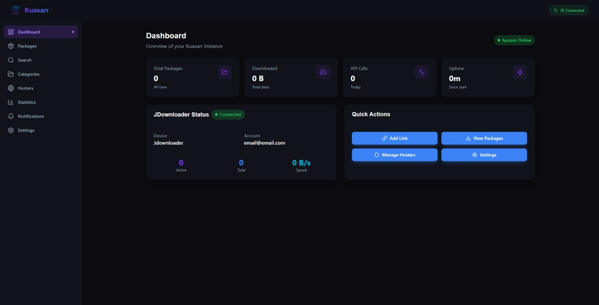

<div align="center">


# Kuasarr

**Bridge JDownloader with Radarr, Sonarr & LazyLibrarian**

[](https://github.com/Ritedt/Kuasarr/pkgs/container/kuasarr)
[](https://github.com/Ritedt/Kuasarr/releases)
[](https://matrix.to/#/@kuasarr-support:envs.net)

</div>

Kuasarr emulates a **Newznab Indexer** and **SABnzbd Client** to integrate JDownloader into your *arr stack. No NZBs, no torrents – pure direct download.

---



---

## Quick Start

```bash
docker run -d \
  --name kuasarr \
  -p 9999:9999 \
  -v /path/to/config:/config \
  ghcr.io/ritedt/kuasarr:latest
```

**Open `http://localhost:9999`** and follow the setup wizard in the WebUI. On first start you're prompted for the internal/external URL directly in the browser — no config file editing required, everything is done through the interface.

> **Tip:** For deterministic deployments (e.g. compose/automated setups), pass `-e INTERNAL_ADDRESS=http://<host-ip>:9999` to skip the first-start prompt. `TZ`, `EXTERNAL_ADDRESS` and the credentials below work the same way.

### Optional: Environment Variables

Environment variables always override WebUI settings (useful for Docker secrets). Anything not set here is configurable through the WebUI.

| Variable | Description |
|----------|-------------|
| `TZ` | Timezone (e.g. `Europe/Berlin`) |
| `INTERNAL_ADDRESS` | Local URL Radarr/Sonarr use to reach Kuasarr |
| `EXTERNAL_ADDRESS` | External URL (defaults to internal) |
| `KUASARR_WEBUI_USER` / `KUASARR_WEBUI_PASS` | Optional WebUI login (ENV or WebUI → Settings → General) |
| `DBC_MAX_CONCURRENT` | Max concurrent CAPTCHA jobs (default `1`; requires restart) |

---

## What is Kuasarr?

Kuasarr automates the entire DDL workflow – from search to download. No manual CAPTCHA solving required.

| Feature | Description |
|---------|-------------|
| 🎨 **Modern UI** | Intuitive dark-theme web interface – complete configuration without CLI |
| 🔍 **Indexer** | Searches DDL sites for releases |
| 🤖 **Auto-CAPTCHA** | Automatic solving via [DeathByCaptcha](https://deathbycaptcha.com/?refid=1237432788a) or [2Captcha](https://2captcha.com/auth/register/?from=26376359) – no manual interaction needed |
| 📥 **Download** | Sends links directly to JDownloader |
| 🎯 **Tracking** | Radarr/Sonarr automatically detect completed downloads |

### Required External Services

| Service | Cost | Purpose |
|---------|------|---------|
| **[FlareSolverr](https://github.com/FlareSolverr/FlareSolverr)** | Free | Bypasses Cloudflare protection |
| **[DeathByCaptcha](https://deathbycaptcha.com/?refid=1237432788a)** or **[2Captcha](https://2captcha.com/auth/register/?from=26376359)** | Paid | Solves CAPTCHAs automatically |
| **[JDownloader 2](https://jdownloader.org)** | Free | Downloads the actual files |

> **Important**: DeathByCaptcha and 2Captcha are **paid services** (approx. $2-4 per 1000 CAPTCHAs). You need an active account with one of them for Kuasarr to work.

---

## Setup Guides

Configuration of external tools is outsourced to dedicated guides:

| Tool | Guide |
|------|-------|
| [FlareSolverr](https://github.com/FlareSolverr/FlareSolverr) | [Setup →](docs/setup/flaresolverr.md) |
| [JDownloader 2](https://jdownloader.org) | [Setup →](docs/setup/jdownloader.md) |
| [Radarr](https://radarr.video) | [Setup →](docs/setup/radarr.md) |
| [Sonarr](https://sonarr.tv) | [Setup →](docs/setup/sonarr.md) |
| [LazyLibrarian](https://lazylibrarian.gitlab.io) | [Setup →](docs/setup/lazylibrarian.md) |

---

## Advanced Configuration

<details>
<summary>CAPTCHA Services</summary>

Configurable via WebUI or environment variables:

| Variable | Service |
|----------|---------|
| `DBC_AUTHTOKEN` | [DeathByCaptcha](https://deathbycaptcha.com/?refid=1237432788a) |
| `TWOCAPTCHA_API_KEY` | [2Captcha](https://2captcha.com/auth/register/?from=26376359) |

</details>

<details>
<summary>WebUI Authentication (optional)</summary>

```bash
docker run -d \
  --name kuasarr \
  -p 9999:9999 \
  -v /path/to/config:/config \
  -e KUASARR_WEBUI_USER=admin \
  -e KUASARR_WEBUI_PASS=securepassword \
  ghcr.io/ritedt/kuasarr:latest
```

API endpoints (`/api/*`, `/download/*`) are secured via API key for *arr integration – no additional authentication required.

</details>

<details>
<summary>Install as PWA</summary>

Kuasarr can be installed as a Progressive Web App:

- **Chrome/Edge**: Address bar → Install icon
- **Android**: Chrome menu → "Add to Home screen"
- **iOS**: Safari → Share → "Add to Home Screen"

Requires HTTPS for full functionality.

</details>

---

## Supported Sources

- NX (with login)
- SJ / DJ (with login)
- Filecrypt (with Circle-Captcha solver)
- More via custom hostnames

---

## Architecture

```
┌─────────┐     ┌─────────┐     ┌─────────┐
│ Radarr  │────→│         │────→│JDownloader
│ Sonarr  │     │ Kuasarr │     │   2     │
│ LazyLib │────→│  :9999  │────→└─────────┘
└─────────┘     └────┬────┘          │
                     │               ↓
                ┌────┴────┐     ┌─────────┐
                │Hostnames│     │  Downloads
                │FlareSolv│     └─────────┘
                └─────────┘
```

---

## Support

- **Matrix**: [@kuasarr-support:envs.net](https://matrix.to/#/@kuasarr-support:envs.net)
- **Issues**: [GitHub Issues](https://github.com/Ritedt/Kuasarr/issues)

---

## License

MIT License – Fork of [rix1337/quasarr](https://github.com/rix1337/quasarr)
